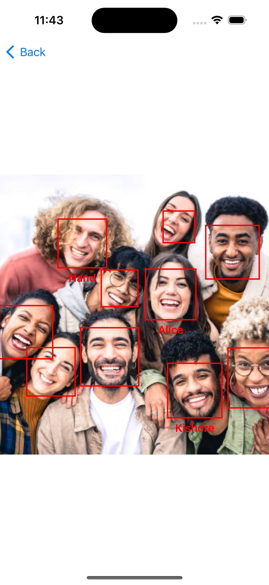

# FaceTagger App

FaceTagger is an iOS application that allows users to detect faces in their photos and tag them with names. The app leverages Vision framework for face detection and provides a clean, user-friendly interface for tagging faces.

## Features

- **Face Detection**: Automatically detects faces in photos using Apple's Vision framework.
- **Tagging**: Allows users to tag detected faces with names.
- **Photo Library Access**: Requests access to the user's photo library to fetch photos.
- **Settings**: Provides an option to open settings if photo library access is denied.

## Screenshots




## Requirements

- iOS 17.2+
- Xcode 15.0+
- Swift 5.0+

## Installation

1. Clone the repository:
    ```sh
    git clone https://github.com/nand4655/FaceTagger.git
    ```
2. Open the project in Xcode:
    ```sh
    cd facetagging
    open FaceTagging.xcodeproj
    ```
3. Build and run the project on your simulator or device.

## Usage

1. Launch the app.
2. Allow access to your photo library.
3. Select a photo to detect faces.
4. Tag detected faces with names.

## Architecture

The app follows the MVVM (Model-View-ViewModel) architecture pattern to ensure a clean separation of concerns and maintainability.

### Project Structure

- **Model**: Contains data models and services.
- **View**: Contains SwiftUI views and UI components.
- **ViewModel**: Contains view models that handle business logic and data binding.
